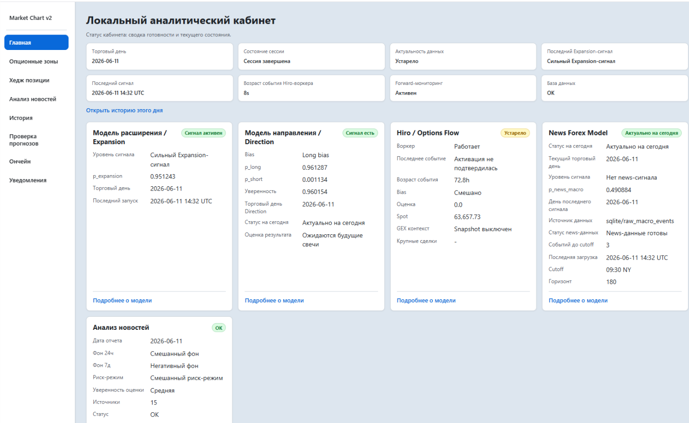
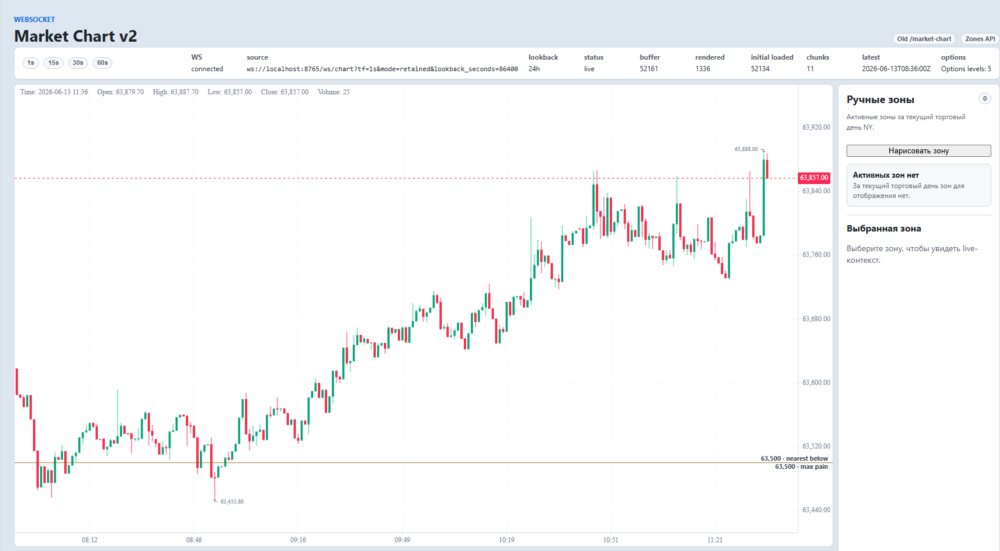
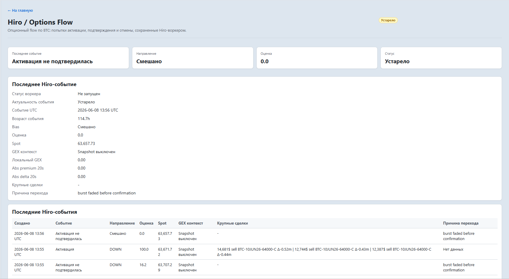
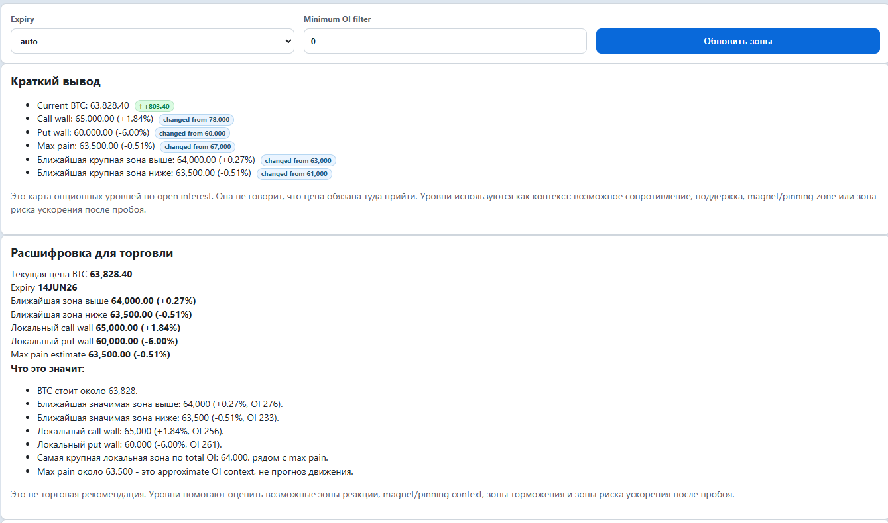
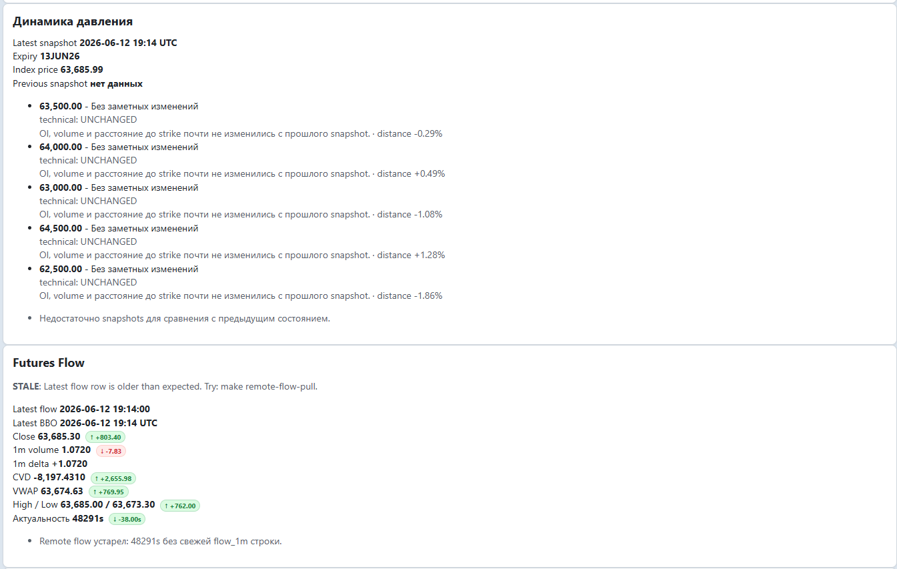
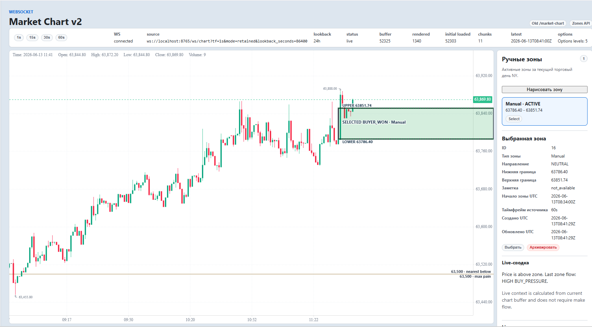
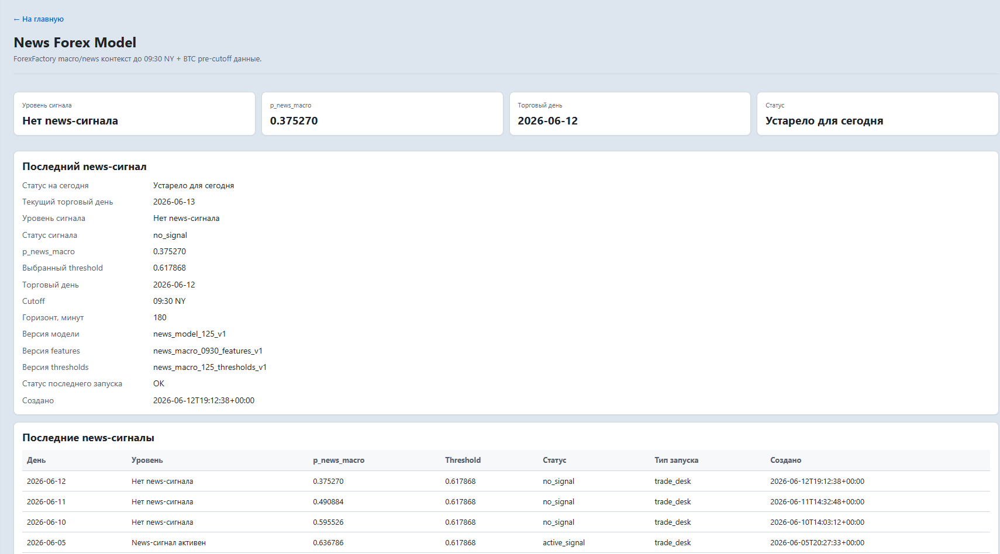
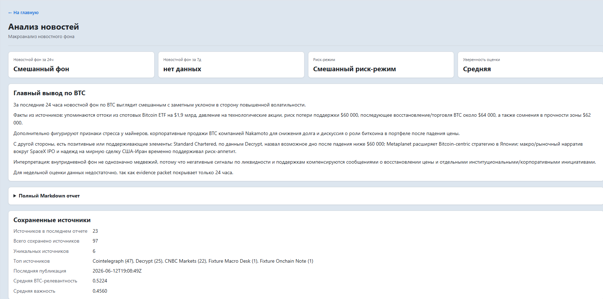
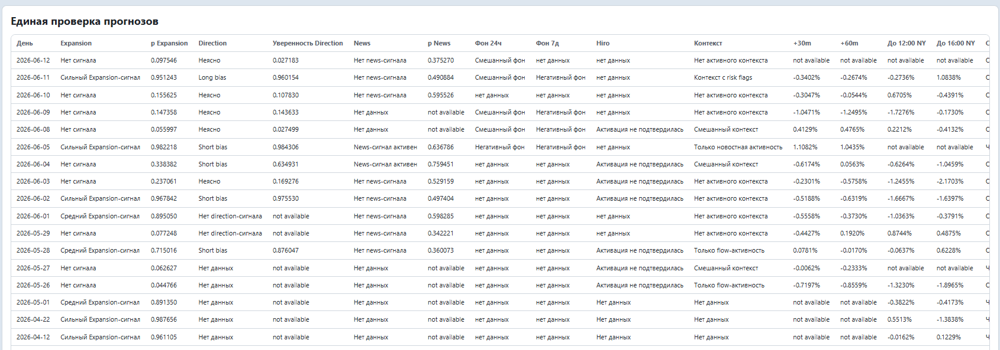
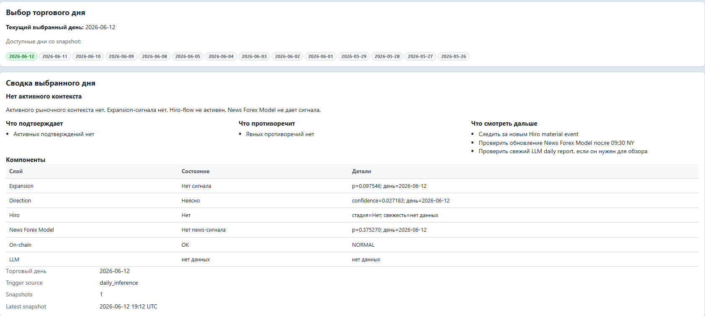

## Проект: Crypto Alpha Intelligence Platform

Это локальный трейдерский аналитический кабинет для BTC, который запускается на ПК и показывает состояние рынка, моделей, сигналов, потоков ордеров, опционных зон, новостей, on-chain контекста, LLM-аналитики и системной готовности.

<br>

</p>
<p align="center">
  
</p>

<p align="center">
  <em>Главный экран локального трейдерского кабинета: модели, market context, signals и system health.</em>
</p>


<br>


Система решает задачу не в формате модель сказала купить/продать, а в формате структурированного market intelligence:

```text
1. Есть ли сегодня режим expansion?
2. Есть ли directional bias?
3. Подтверждает ли futures/order-flow этот контекст?
4. Есть ли активность в options-flow?
5. Где находятся важные call/put walls и зоны давления?
6. Что происходит с CVD, delta volume, VWAP, BBO и flow aggregation?
7. Есть ли новости или on-chain risk flags?
8. Что говорит LLM Analyst на основе сохраненного локального контекста?
9. Что произошло после похожих сигналов исторически и в forward?
10. Готова ли система к live session?
```

Проект выходит далеко за рамки стандартного подхода “обучил модель в ноутбуке и получил метрику”, потому что включает полный жизненный цикл ML/AI-системы — от получения рыночных данных до live-запуска, мониторинга, проверки результатов и ежедневной работы.

```text
Сырые рыночные данные
→ проверка качества данных
→ расчет признаков с учетом времени и cutoff
→ зафиксированные модельные пакеты
→ запуск моделей в рабочем runtime-контуре
→ уровни сигналов
→ сохранение результатов в SQLite
→ live workflow торговой сессии
→ WebSocket-инфраструктура и удаленный поток рыночных данных
→ dashboard для оператора
→ обновление review/outcome результатов
→ ежедневные LLM-отчеты
→ forward monitoring
→ резервное копирование и процедура закрытия рабочего дня
```

То есть проект устроен как полноценная рабочая система: данные приходят, проходят проверки, превращаются в признаки, модели дают результат, сигналы сохраняются, dashboard показывает состояние рынка, а отдельные review/outcome-слои позволяют позже проверить, насколько полезными были сигналы и рыночные гипотезы.

## 3. Почему проект выделяется

Во многих ML-проектах работа заканчивается на уровне исследования: загрузка датасета, обучение модели, получение метрики и сохранение ноута.

Мой проект построен как полноценная production система вокруг ML-моделей:

```text
- создана доменная архитектура системы
- выделены независимые модельные слои
- зафиксирована cutoff policy
- собран time-aware feature pipeline
- упакованы model artifacts
- реализован inference runtime
- добавлено SQLite-хранилище состояния
- реализованы signal logs
- добавлены review/outcome слои
- создан read-only dashboard
- добавлен realtime order-flow collector
- реализован WebSocket Live Chart
- добавлены options zones и flow near zones
- интегрирован LLM Analyst
- добавлены tests
- подготовлены docs/runbooks
- стабилизированы live-day сценарии
```

Главная ценность проекта в том, что ML-модели не существуют отдельно от инфраструктуры. 
Они встроены в рабочий аналитический контур.


## 4. Ядро системы: авторские Expansion Model + Direction Model

Главное ядро проекта — не одна готовая модель и не стандартный подход из статьи или tutorial, а связка двух авторских ML-слоев, которые я спроектировал и разработал самостоятельно: от рыночной идеи и логики постановки задачи до подготовки данных, feature engineering, обучения, проверки метрик, упаковки моделей и внедрения в рабочий runtime-контур.

Это модели собственной разработки, основанные на моем самостоятельном анализе поведения BTC-рынка, внутридневных режимов, структуры движения цены, потока ордеров, реакции рынка до cutoff и разделения рыночного дня на разные типы контекста. Я сам сформулировал, какие задачи должны решать модели, какие данные им доступны, как избежать утечек, какие признаки использовать, как разделить режим рынка и направление движения, как выбирать thresholds и как встроить результаты в рабочую систему.

**Ключевая идея ядра:**

```text
Expansion Model
→ определяет, есть ли рыночный режим expansion:
  день похож на потенциально импульсный / расширяющийся день
  или рынок больше похож на balanced / range regime

Direction Model
→ определяет directional bias внутри рыночного контекста:
  если есть потенциал движения, куда вероятнее смещение:
  LONG_BIAS / SHORT_BIAS / UNCLEAR
```

Это важное архитектурное решение. Я не смешивал две разные задачи — “есть ли потенциал сильного движения” и “куда именно вероятнее движение” — в одну универсальную модель. Вместо этого я разделил систему на два независимых модельных слоя, каждый со своей постановкой задачи, подготовкой данных, логикой признаков, проверкой качества и ролью в итоговом market context.

Важно, что Expansion Model и Direction Model — это не две модели, обученные на одном и том же наборе данных и не дублирующие друг друга. Это два разных исследовательских слоя:

У этих моделей разная логика, разные целевые задачи, разная подготовка данных и разный смысл в системе. Expansion Model работает как фильтр рыночного режима, а Direction Model — как отдельный слой оценки направленного bias. Поэтому они не конкурируют друг с другом, а дополняют друг друга.

Такой подход делает архитектуру чище и сильнее: сначала система определяет, есть ли вообще подходящий рыночный режим для сильного движения, затем отдельно оценивает направление, а после этого проверяет контекст через поток сделок, опционные зоны, derivatives/options-flow, новости, on-chain данные и LLM-аналитику.

Вместо одной перегруженной модели “на всё” я построил многоуровневое ядро, где каждый слой отвечает на отдельный рыночный вопрос и проходит собственную проверку качества.

В итоге получилось что я не просто применил готовый алгоритм к датасету, а самостоятельно разработал логику модельного ядра, подготовил данные, построил признаки, обучил модели, проверил их без утечек, упаковал в production runtime и встроил в живой аналитический кабинет.

## 5. Expansion Model: ключевой режимный слой


<br>

</p>
<p align="center">
  
</p>

<br>

</p>
<p align="center">
  
</p>

<p align="center">
  <em>Expansion Model</em>
</p>


<br>


`Expansion Model v1` — главный рабочий ML-слой системы. Это авторская модель, которая отвечает не за покупку или продажу, а за более важный первый вопрос:

```text
Похож ли текущий BTC trading day на expansion day?
```

То есть модель определяет рыночный режим: есть ли среда, в которой вообще можно ожидать сильного расширения диапазона, или рынок больше похож на balanced/range day.

Это не простая directional-классификация. Это режимный фильтр рынка, который стоит в ядре всей системы.

Модель работает на BTCUSDT 5m candles со строгим New York cutoff. Все признаки строятся только из данных, доступных до cutoff, без будущих свечей и без leakage.


## 6. Метрики Expansion Model

Главная ценность Expansion Model — сильные метрики на pretest  / test / walk-forward-style проверке без утечек данных.

Задача модели:

```text
К 10:00 NY определить, будет ли день expansion day.
Expansion = bearish expansion OR bullish expansion.
Это не прогноз long/short, а именно определение рыночного режима.
```

В исследовании проверялись разные режимы признаков:

```text
current_only: 205 features
current_plus_last1: 208 features
current_plus_last3: 229 features
```

Главные результаты на 194 pretest днях:

```text
Лучший общий режим:
current_plus_last1
mean precision = 0.7514
min precision = 0.7000
mean recall = 0.7824
mean balanced accuracy = 0.8202
mean average precision = 0.8315
```

Самый сильный практический сигнал:

```text
EXPANSION_STRONG
signals = 25
mean precision = 0.9667
worst-fold precision = 0.9000
recall = 0.3856
false signals = 1
pooled precision = 0.9600
```

Это очень сильный результат для финансовых временных рядов: модель давала редкие, но крайне точные STRONG-сигналы.

Второй слой, лучший balanced operational tier:

```text
EXPANSION_MEDIUM
signals = 55
mean precision = 0.8216
worst-fold precision = 0.7895
recall = 0.7294
pooled precision = 0.8182
pooled recall = 0.7031
```

Покрытие:

```text
Всего pretest дней: 194
Реальных expansion days: 64
Balanced/range days: 130

STRONG:
поймано 24 из 64 expansion days
25 сигналов
1 ложный сигнал

MEDIUM:
поймано 45 из 64 expansion days
55 сигналов
10 ложных сигналов
```

Почему это сильный результат:

```text
1. Метрики не накручены частыми сигналами.
2. STRONG tier имеет почти снайперский precision.
3. MEDIUM tier дает сильный баланс precision и recall.
4. Есть worst-fold precision (walk-forward test), а не только красивая средняя метрика.
5. Thresholds выбирались с учетом false positives, устойчивости по fold-ам и реального применения.
```

Я не оптимизировал модель ради красивой accuracy. Я строил operational threshold logic: меньше случайных сигналов, больше устойчивости, честная проверка без утечек и понятная практическая роль каждого tier.

## 7. Direction Model: отдельный слой направления

<br>

</p>
<p align="center">
  
</p>

<br>

</p>
<p align="center">
  
</p>

<p align="center">
  <em>Direction Model</em>
</p>


<br>


`Direction Model v1` — второй авторский ML-слой системы. Он не дублирует Expansion Model и не обучен “на том же самом”. Это отдельная модель со своей задачей, своими данными, признаками, проверкой и ролью в системе.

Она отвечает на вопрос:

```text
Если рыночный контекст активен, куда вероятнее смещение рынка?
```

Выход модели:

```text
LONG_BIAS
SHORT_BIAS
UNCLEAR
NO_DIRECTION_SIGNAL
```

Главная архитектурная сила: Direction не смешан с Expansion. Expansion определяет режим рынка, Direction отдельно оценивает направление. Это делает систему чище, интерпретируемее и ближе к реальному многоуровневому research-процессу.

Direction вынесен в полноценный runtime-слой.

## 8. Метрики Direction / Profile layer

Direction/Profile layer показал сильные результаты на 194 pretest днях.

Лучший общий режим:

```text
current_only
mean balanced accuracy = 0.8078
min balanced accuracy = 0.7073
mean macro F1 = 0.7377
min macro F1 = 0.6473
pass_all_main = True
```

Сильные operational-зоны:

```text
LONG_STRONG 
signals = 19
mean precision = 0.7758
mean recall = 0.4622
valid folds = 3/3
pass_all_operational = True

BALANCED_MEDIUM
signals = 107
mean precision = 0.8927
mean recall = 0.7329
valid folds = 3/3
pass_all_operational = True

BALANCED_STRONG
signals = 85
mean precision = 0.8923
mean recall = 0.5772
valid folds = 3/3
pass_all_operational = True
```

Для bearish side STRONG tiers дали особенно высокую точность:

```text
SHORT_STRONG
mean precision = 0.9375
min precision = 0.8750
```

Важно: я не переношу любой красивый high-precision tier в рабочую логику автоматически. Если не хватает числа сигналов, fold-level стабильности или доказательной базы, такой режим остается исследовательским.

Это показывает правильный подход к ML validation: модель оценивается не по одной красивой метрике, а по устойчивости, количеству сигналов, worst-fold качеству и практической применимости.


## 9. Почему этим метрикам можно доверять

**Главное: модель не подгонялась под историю!**

В финансовых временных рядах самая частая проблема — не слабая модель, а **переобучение и подгонка под исторические данные**. Именно поэтому многие торговые ML-системы красиво выглядят на backtest, но разваливаются на walk-forward.

В моем проекте сильная сторона не только в самих метриках, а в том, **как именно они были получены**.

Модели проверялись через walk-forward / pretest-подход, а вся runtime-логика построена так, чтобы признаки соответствовали только тем данным, которые реально были доступны до cutoff. То есть модель не получает будущие свечи, не использует информацию после момента принятия решения и не строится на “подсмотренных” данных.

**Критически важный принцип: признаки не подгонялись ради метрик!**

В проекте нет подхода “найдем еще 100 признаков, пока метрика не станет красивой”. Я не строил систему через бесконечный перебор новых фичей, которые случайно улучшают результат на истории.

Признаки в моделях фиксируют реальный рыночный контекст, который доступен каждый день:

```text
- контекст текущего торгового дня
- профили волатильности
- профили движения
- положение цены относительно важных уровней
- структуру движения до cutoff
- внутридневную микроструктуру
- временной контекст
- расстояния до high / low / open / ключевых зон
- динамику цены до момента принятия решения
```

То есть признаки не являются “подгонкой под метрику”. Они отражают то, что действительно можно наблюдать в рынке до момента запуска модели.

**Критически важно: в системене нет признаков, которые можно оптимизировать, нет оптимизации и подгонки под историю!**

**Я не улучшал метрики искусственным feature mining!**

**Это принципиальная часть проекта:**

```text
- не искать случайные признаки ради красивой метрики
- не подгонять модель под историю
- не использовать будущие свечи
- не менять признаки бесконечно после каждого результата
- не смешивать research-гипотезы с operational-логикой
- не переносить tier в рабочий контур без стабильности
```

Признаки, которые используются в модели, зафиксированы через feature list и runtime-проверки. В рабочем контуре модель получает тот же тип feature vector, который был доступен в реальный момент принятия решения.


## Почему это важно

В trading ML можно легко “обмануть себя”: добавить признаки, которые случайно хорошо объясняют прошлое, получить красивый backtest и потом увидеть провал на walk-forward.

**Я строил систему наоборот:**

```text
Сначала рыночная логика
→ затем признаки, отражающие эту логику
→ затем walk-forward / pretest проверка
→ затем frozen feature list
→ затем frozen thresholds
→ затем runtime inference
→ затем review / outcome monitoring
```

Это показывает, что модель не просто обучена на исторических свечах. Она встроена в систему так, чтобы ее входные данные соответствовали реальному моменту принятия решения.


## 10. Live Futures / Order-Flow слой

Один из самых сильных differentiators проекта — собственный live futures/order-flow слой.

В проекте реализован server-side collector для Bybit BTCUSDT market microstructure:

```text
Bybit WebSocket
→ raw trades
→ best bid / ask
→ 1s flow aggregation
→ 5s / 1m flow views
→ CVD
→ delta volume
→ delta notional
→ VWAP
→ high / low / close
→ compact export
→ local cabinet pull
```

Collector работает отдельно на VPS, а локальный кабинет читает compact SQLite snapshot read-only. 

**Это правильная архитектурная граница:**

```text
VPS collector собирает live market microstructure
локальный ПК скачивает compact flow_latest.sqlite
crypto-alpha-v2 читает flow.sqlite read-only
dashboard показывает futures-flow рядом с Options Zones
```

Этот слой демонстрирует практические навыки работы с realtime market data и production-like data infrastructure:

```text
1. Работа с WebSocket market data и live-потоками биржевых данных.
2. Разработка long-running collector для непрерывного сбора данных.
3. Агрегация tick/order-flow данных в 1s / 5s / 1m представления.
4. Хранение realtime data в SQLite с учетом последующей аналитики.
5. Compact export вместо тяжелой передачи полного raw archive.
6. Диагностика freshness, stale states, collector_state и service health.
7. Разделение remote data writer и local read-only analytics.
```

Это выводит проект за рамки backtest-подхода: в системе есть полноценный live data infrastructure слой, который собирает, агрегирует, проверяет и доставляет рыночные данные в локальный аналитический кабинет.


## 11. Собственный WebSocket Live Chart / Market Chart

Собственный live-график рынка внутри локального кабинета.


<br>

</p>
<p align="center">
  
</p>

<p align="center">
  <em>WebSocket Chart</em>
</p>


<br>


Я не просто вывел статичную картинку или таблицу со свечами. В проекте реализован собственный `/market-chart_v2`, который получает live-данные через собственный WebSocket со своего сервера от потока ордеров, двигается в реальном времени и связан с моим серверным collector-слоем.

Это важный шаг от ML-модели к настоящему рабочему инструменту: я открываю локальный dashboard и вижу живой график BTC, потоковые данные, зоны, реакцию цены и контекст рынка в одном месте.

**Архитектура устроена так:**

```text
VPS collector собирает live market data
→ пишет потоковые данные в flow.sqlite
→ WebSocket service читает flow.sqlite только read-only
→ сервис доступен только на 127.0.0.1:8765
→ локальный SSH tunnel дает ws://localhost:8765
→ /market-chart в dashboard показывает живой график
```

Сильная сторона здесь не только в самом графике, а в том, что вокруг него построена правильная realtime-инфраструктура:

```text
- сервер собирает данные
- локальный кабинет безопасно получает live stream
- dashboard не пишет live-flow в базу
- WebSocket service работает read-only
- SSH tunnel не собирает данные, а только дает безопасный доступ
- при обрыве tunnel данные не теряются
- после переподключения график получает свежий live-window
```

Это полноценный realtime UI/data bridge: серверный сбор данных, SQLite-хранилище потока, read-only WebSocket service, безопасный SSH tunnel и локальный dashboard.

**В проекте реализованы отдельные компоненты для этого слоя:**

```text
server_services/Collector Flow/live_chart_ws_server.py
server_services/Collector Flow/run_live_chart_ws_server.sh
server_services/Collector Flow/install_live_chart_ws_service.sh
scripts/start_live_chart_tunnel.sh
scripts/check_live_chart_ws.py
```

**И отдельные команды для оператора:**

```text
make live-chart-tunnel
make live-chart-status
make deploy-live-chart-ws
make vps-live-chart-status
make vps-live-chart-restart
```

Получился не только research и метрики, но и живой пользовательский инструмент, которым реально можно пользоваться во время торговой сессии.


---

## 12. Options Flow / Hiro / Derivatives слой

Один из самых сильных слоев проекта — собственный `Hiro-like` options-flow layer.


<br>

</p>
<p align="center">
  
</p>

<p align="center">
  <em>Hiro</em>
</p>


<br>


По сути, я реализовал авторский аналог логики дорогих коммерческих индикаторов опционного потока: не просто “показать опционы”, а отслеживать, появляется ли в рынке реальный опционный импульс, подтверждается ли он, затухает ли, конфликтует ли с ML-моделями и влияет ли на общий рыночный контекст.

Это отдельный слой derivatives intelligence внутри кабинета.

**В проекте реализованы:**

```text
app/hiro/ws_hiro_vnext.py
app/storage/hiro_events.py
app/dashboard/hiro.py
scripts/run_hiro_worker.py
scripts/show_remote_hiro_status.py
server_services/Collector Hiro/
```

Hiro-слой подключается к Deribit WebSocket, читает поток BTC options trades и BTC perpetual context, анализирует активность опционного рынка и переводит ее в понятные material states:

```text
ACTIVATING
→ в опционах появляется значимый импульс

CONFIRMED
→ импульс подтвердился и стал важным market-flow событием

FAILED_ACTIVATION
→ попытка импульса была, но flow не подтвердился

CANCELLED
→ активность погасла или потеряла актуальность
```

Это важно, потому что рынок движется не только по цене. В derivatives/options-flow часто видно, где появляется давление, где участники начинают набирать риск, где идет активация, а где движение не получает подтверждения.

**Этот слой отвечает на вопросы:**

```text
- есть ли сейчас опционный импульс
- появилась ли значимая активность в BTC options
- есть ли call/put pressure
- подтверждается ли движение через derivatives flow
- затухает ли flow после активации
- есть ли конфликт между ML-сигналом и options-flow
- усиливает ли Hiro общий рыночный bias
```

Сильная сторона в том, что это не ML и не обычный индикатор по свечам. Это слой рыночного контекста: он смотрит на поток событий, оценивает их силу, переводит в состояния и сохраняет важные данные в SQLite.

Архитектурно Hiro живет отдельно от Expansion, Direction и News. Он не ломает модельный контур и не подменяет ML-сигналы. Его задача — дать независимое подтверждение или противоречие со стороны derivatives/options-flow.

```text
Expansion Model
→ есть ли режим expansion

Direction Model
→ куда вероятнее bias

Hiro / Options Flow
→ подтверждает ли derivatives-flow этот контекст
```

Это делает систему намного сильнее обычного ML-проекта. Большинство проектов ограничиваются свечами и моделью. Здесь же добавлен отдельный слой рыночной микроструктуры и опционного потока, который помогает понять, есть ли за движением реальное давление со стороны derivatives market.


Hiro-like слой особенно важен, потому что он показывает умение работать с более сложным рыночным контекстом: не только “цена выросла/упала”, а “в рынке появился опционный импульс, он подтвердился или не подтвердился, и это можно использовать как отдельный слой доказательности”.


## 13. Options Zones, Options Pressure и Flow near Zones

В проекте реализован отдельный слой для анализа опционных зон, давления и реакции цены рядом с важными уровнями.


<br>

</p>
<p align="center">
  
</p>

<p align="center">
  <em>Options Zones</em>
</p>


<br>


Это не просто таблица с опционами. Система строит карту рыночного давления: где находятся важные call/put зоны, где может быть притяжение цены, где рынок может встретить сопротивление, где есть риск пробоя, защиты зоны или ловушки участников.

**Зонвы выведены на график**

**В проекте этот слой вынесен в отдельные модули:**

```text
app/options_zones/
app/options_pressure/
app/options_flow_map/
app/dashboard/options_zones.py
app/storage/options_pressure_snapshots.py
scripts/sync_options_pressure_snapshot.py
scripts/show_options_pressure_status.py
scripts/write_flow_context_snapshot.py
```

**Основные возможности слоя:**

```text
Options Zones
Options Pressure
Options Flow Map
Call / Put walls
Max pain
Nearest zones
Global walls
Pressure snapshots
Flow near zones
Zone interpretation
Zone reaction
Zone flow metrics
Zone big trades
Zone trap context
```

**Проще говоря, система помогает ответить на вопросы:**

```text
- где рядом с ценой находятся важные опционные зоны
- где стоит крупное call/put давление
- какая зона может быть магнитом для цены
- какая зона может выступать сопротивлением или поддержкой
- подтверждает ли futures-flow движение к зоне
- есть ли конфликт между ценой, опционами и потоком сделок
- есть ли крупные сделки рядом с зоной
- есть ли признаки trapped buyers / trapped sellers
- есть ли absorption или защита зоны
```

**Особенно сильная часть — связь опционных зон с live futures/order-flow. То есть система не просто показывает “вот уровень”, а смотрит, что происходит рядом с ним в реальном потоке:**


<br>

</p>
<p align="center">
  
</p>

<p align="center">
  <em>Flow</em>
</p>


<br>


```text
Цена подошла к зоне
→ система проверяет flow рядом с зоной
→ смотрит CVD, delta volume, VWAP, крупные сделки
→ определяет, есть ли покупательское или продавецкое давление
→ показывает, подтверждается ли реакция зоны или нет
```

Пользователь видит не только сигнал модели, но и рыночную карту: где находятся важные зоны, как цена с ними взаимодействует, есть ли подтверждение потоком сделок и где может быть конфликт.


## 14. Manual Zones и Zone Reaction Engine

Один из самых сильных инженерных слоев проекта — `Manual Zones` и `Zone Reaction Engine`. Это не просто визуальная разметка уровней на графике, а отдельная подсистема, которая переводит рыночный анализ, в измеряемый, сохраняемый и проверяемый data workflow.


<br>

</p>
<p align="center">
  
</p>

<p align="center">
  <em>Ручные зоны</em>
</p>


<br>

**В проекте реализован полный контур работы с пользовательскими рыночными зонами:**

```text id="fk9j23"
app/storage/manual_zones.py
app/storage/zone_reactions.py
app/storage/zone_reaction_events.py
app/storage/zone_reaction_outcomes.py
app/market_chart/zone_reaction.py
app/market_chart/zone_flow_metrics.py
app/market_chart/zone_big_trades.py
app/market_chart/zone_trap_context.py
app/review/zone_reaction_outcomes.py
app/dashboard/zone_review.py
```

Смысл этого слоя в том, что пользователь может отметить важную рыночную зону — например PDL, PDH, уровень ликвидности, дисбаланс, область возможной реакции или trap-зону, — а система дальше не просто отображает ее на графике, а начинает сопровождать эту зону как объект данных.

**Рабочий контур выглядит так:**

```text
Пользователь отмечает manual zone
→ зона сохраняется в SQLite
→ dashboard отображает ее на market chart
→ система отслеживает положение цены относительно зоны
→ фиксирует touch / inside / exit / rejection / acceptance
→ сохраняет reaction events
→ считает flow metrics рядом с зоной
→ анализирует big trades и trap / absorption context
→ обновляет zone outcomes
→ показывает historical review и reaction timeline
→ LLM Zone Context объясняет, что означает текущая реакция
```

Это превращает ручной анализ из “субъективной заметки на графике” в структурированный анализ уровня.

**А именно:** 

Отметили уровень и видим какую то реакцию, но что реально было там, внутри уровня, кто победил, куда направлен поток, выдержал этот уровень или нет - именно это позволяет узнать этот инструмент.

Зона становится полноценным объектом системы: у нее есть статус, история, события, реакция цены, flow-контекст, outcome и review.

Сильная сторона этого слоя в том, что он соединяет discretionary workflow и системную аналитику:

```text id="smtgwi"
1. Пользовательская гипотеза становится структурированным объектом данных.
2. Реакция цены на зону фиксируется не вручную в памяти, а через persisted events.
3. Система различает состояния зоны: ожидание, вход в зону, выход, rejection, acceptance, trap/absorption context.
4. Рядом с зоной считаются flow metrics, чтобы видеть, подтверждает ли поток реакцию цены.
5. Big trades и trap context дают дополнительный microstructure-сигнал.
6. Outcomes позволяют позже проверить, какие типы зон и реакций реально работали.
7. Dashboard показывает не только текущую зону, но и историю ее поведения.
```

Это важный слой проекта, потому что здесь есть мост между ручным трейдерским мышлением и инженерной системой проверки гипотез.

Архитектурно это особенно ценно: модельные слои отвечают за regime/direction, options-flow показывает derivatives pressure, remote futures-flow показывает поток сделок, а Manual Zones + Zone Reaction Engine позволяют проверить, как рынок ведет себя в конкретных важных областях цены.

**Пример логики, которую может поддерживать такой слой:**

```text
Цена вошла в manual zone
→ система определила текущую позицию цены относительно зоны
→ зафиксировала reaction event
→ посчитала flow metrics вокруг зоны
→ проверила наличие крупных сделок
→ оценила trap / absorption context
→ сохранила outcome
→ показала historical review
```

Этот блок особенно важен, потому что он показывает, что я умею строить не только ML-модели, но и аналитические инструменты вокруг реального процесса принятия решений. Я могу взять неформальную экспертную гипотезу, формализовать ее в data model, подключить realtime/contextual data, сохранить события, построить review layer и сделать это доступным через понятный dashboard.

Система не просто предсказывает, а помогает пользователю структурировать рынок, проверять гипотезы и накапливать доказательную базу по тому, какие зоны, реакции и flow-контексты действительно имеют практическую ценность.


## 15. База данных

Проект построен вокруг SQLite storage backbone.

Storage-слой включает таблицы и helper-модули для:

```text
model_runs
signal_log
signal_outcomes
forward_monitoring
direction_runs
direction_signal_log
direction_signal_outcomes
news_model_runs
news_signal_log
news_signal_outcomes
macro_events
onchain_snapshots
options_pressure_snapshots
flow_context_snapshots
market_context_snapshots
hiro_events
llm_reports
llm_chat
manual_zones
zone_reactions
zone_reaction_events
zone_reaction_outcomes
news_intel_reports
news_intel_sources
news_intel_report_outcomes
system_events
```


## 17. Dashboard

Проект содержит большой read-only dashboard/cabinet.

Это не техническая заглушка, а рабочий интерфейс пользователя, где можно видеть состояние всех слоев:

```text
Latest Signal
Session Desk
Session Readiness
System Health
Model Summary
Expansion Model
Direction Model
Hiro / Options Flow
News Model
News Intelligence
On-chain
Options Zones
Market Chart
Market Chart v2
Hedge Planner
LLM Analyst
Final Bias
Forecast Evidence
Context Review
Forward Monitoring
Browser Alerts
Zone Review
```

**Ключевой принцип:**

```text
- dashboard read-only
- инференс и записи идут через контролируемые scripts/Makefile commands
- UI показывает состояние, но не делает опасных скрытых write actions
```

Это снижает риск случайного изменения данных и делает систему надежнее.


## 18. Реализация через makefile

Проект имеет развитую систему команд, которая превращает набор скриптов в управляемый локальный продукт.

**Главные команды:**

```text
make open
  Запускает основной live workflow: туннель для live chart, обновление evidence, старт dashboard-session и trade desk live-режим.

make close
  Закрывает рабочую сессию: сбрасывает dashboard-session, обновляет evidence/reviews, создает LLM daily report и делает backup базы.

make flow
  Обновляет flow-контекст: забирает compact futures-flow с VPS, проверяет remote flow status, обновляет options pressure и пишет flow context snapshot.

make live-chart-status
  Проверяет WebSocket Live Chart endpoint: доступность локального WS-туннеля, свежесть live candles и состояние live chart потока.

make cabinet-status
  Показывает общий статус кабинета: готовность данных, последние сигналы, market context, Hiro/flow состояние и предупреждения.

make data-status
  Проверяет состояние BTCUSDT 5m candles: последнюю свечу, freshness, gaps и готовность данных для моделей.

make latest-signal
  Показывает последний Expansion signal: trading day, p_expansion, signal tier, model version и статус.

make latest-direction-signal
  Показывает последний Direction signal: LONG_BIAS / SHORT_BIAS / UNCLEAR, confidence, trading day и статус.

make latest-news-signal
  Показывает последний News Model signal: news tier, p_news_macro, trading day и статус.

make latest-llm-report
  Показывает последний сохраненный LLM daily analyst report из SQLite.

make sync-candles
  Синхронизирует BTCUSDT 5m candles с Bybit и сохраняет новые закрытые свечи в локальную SQLite.

make session-check
  Проверяет готовность торговой сессии: есть ли нужная 09:55 NY свеча, полное окно данных и можно ли запускать inference.

make backup-db
  Создает backup локальной SQLite базы и оставляет последние N резервных копий.

make evidence-update
  Обновляет evidence/outcomes: candles, Expansion outcomes, Direction outcomes, News outcomes и Context Review.

make context-review-status
  Показывает статус Context Review: сколько outcomes сохранено, оценено, ожидает будущие свечи или имеет недостаточно данных.

make direction-review-status
  Показывает статус Direction outcomes/review: оцененные, pending и проблемные Direction-сигналы.

make news-review-status
  Показывает статус News Model outcomes/review: оцененные, pending и недостаточные по данным news-сигналы.

make zone-outcomes-status
  Показывает статус outcomes по Manual Zones / Zone Reaction Engine: какие реакции зон уже оценены и что ожидает данных.
```


**И все эти команды по сути собраны в два действия:**

- **make open** - откроет сессию, все посчитает и загрузит
- **make close** - закроет сессию, все посчитает и сохранит БД


## 19. LLM Analyst как помощник

LLM-слой в проекте не “предсказывает рынок” и не заменяет модели. Его роль — структурировать вывод всех слоев и собрать вместе.

**Он:**

```text
- читает bounded local cabinet context
- отвечает только в рамках scope gate
- формирует structured daily report
- объясняет состояние моделей и market context
- показывает risk flags, drivers, contradictions
- сохраняет отчеты в SQLite
- не меняет model outputs
- не является источником buy/sell команд
```

**В проекте реализованы:**

```text
app/llm/context_builder.py
app/llm/scope_gate.py
app/llm/daily_report.py
app/llm/report_schema.py
app/llm/prompts.py
app/storage/llm_reports.py
scripts/run_llm_daily_report.py
scripts/show_latest_llm_report.py
```

---

## 20. News Model и News Intelligence

В проекте реализован отдельный макро-новостной слой, который помогает оценивать рыночный фон, настроение участников и потенциальные внешние драйверы движения BTC.

Это важная часть системы, потому что рынок двигается не только по свечам, flow и опционам. На BTC сильно влияют макроэкономические события, новости по доллару, ставкам, инфляции, риску, ликвидности, геополитике и общему sentiment на рынке. Поэтому в проекте есть не один, а два новостных слоя.

## Первый слой — `News Forex Model 125`.

`NEWS + BTC 09:30 RF 1.25` — авторская исследовательская ML-модель для оценки риска сильного движения BTC после 09:30 NY.


<br>

</p>
<p align="center">
  
</p>

<p align="center">
  <em>News model</em>
</p>


<br>


Это не BUY/SELL-модель и не модель направления. Ее задача — определить, повышена ли вероятность, что BTC сделает expansion минимум на `1.25%` в любую сторону в течение следующих 180 минут после 09:30 NY.

Модель использует только данные, которые честно доступны до cutoff:

```text
USD macro news до 09:30 NY
+ BTC pre-cutoff context
+ поведение цены до 09:30
+ микроструктуру
+ поток ордеров
```

**Модель помогает кабинету понять:**

```text
- сегодня есть повышенный макро/рыночный риск сильного движения
- или день больше похож на обычный спокойный режим
```

**Самый сильный результат:**

```text
Final holdout:
186 дней
42 сигнала
38 правильных
4 ложных
precision = 90.5%
```

**Top-risk качество:**

```text
holdout PR-AUC = 0.8247
holdout ROC-AUC = 0.7893
Top20 precision = 94.6%
Top30 precision = 83.9%
```

**Модель не шумит каждый день:**

```text
сигналы появляются примерно в 22.6% дней
в среднем 1 сигнал раз в 4.4 дня
```

Это делает ее удобной для кабинета: она работает как селективный фильтр повышенного expansion-risk, а не как постоянный шумный индикатор.

Главная инженерная сила модели — строгая защита от leakage:

```text
- не используются новости после 09:30
- не используется BTC движение после 09:30
- threshold выбран только на VAL
- holdout не использовался для подбора threshold
- дни после конца news-архива не считались фейковыми NO_NEWS
- Нет признаков дял оптимизации
- все проверено через walk-forward
```

**Главный вывод:**

`NEWS + BTC 09:30 RF 1.25` — сильный макро-контекстный слой для трейдерского кабинета. Он помогает заранее видеть дни с повышенным риском expansion после 09:30 NY, усиливает понимание рыночного фона и дополняет Expansion Model, Direction Model, Hiro/options-flow, on-chain и LLM Analyst.


## Второй слой — `News Intelligence`.

Это LLM-assisted слой для анализа новостного фона. Он собирает только разрешенные публичные источники, сохраняет принятые источники, строит структурированный LLM-отчет и помогает понять, какой сейчас новостной и макро-сантимент вокруг рынка.


<br>

</p>
<p align="center">
  
</p>

<p align="center">
  <em>LLM Report</em>
</p>


<br>


**Он отвечает на вопросы:**

```text
- какие новости сейчас важны для BTC
- какой общий sentiment: risk-on / risk-off / neutral
- есть ли макро-драйверы для волатильности
- есть ли новости, которые усиливают или ломают модельный сигнал
- есть ли risk flags
- есть ли противоречия между моделями, flow и новостным фоном
- какие события нужно отслеживать дальше
```

News Intelligence не является торговым сигналом и не подменяет ML-модели. Это аналитический слой, который помогает системе объяснять рыночный фон:

```text
- модели показывают режим и направление
- flow показывает давление сделок
- options-flow показывает derivatives context
- news intelligence показывает внешний макро-сантимент
- LLM Analyst собирает это в понятный отчет
```

**Что делает News Intelligence:**

```text
- собирает новости с разрешенных источников
- сохраняет 
- строит структурированный LLM отчет
- выделяет sentiment, drivers, contradictions и risk flags
- считает post-report research outcomes
- показывает read-only dashboard
- не смешивается с Expansion/Direction без доказательной базы
```

**Сильная сторона этого слоя в том, что новости не используются хаотично. Они превращены в проверяемый data workflow:**

```text
Новость / макро-событие
→ нормализация
→ сохранение evidence
→ LLM-анализ
→ структурированный отчет
→ сохранение accepted sources
→ outcome review
→ dashboard display
```

Особенно важно, что News Intelligence помогает понять не только “что произошло”, но и “как это может менять восприятие риска рынком”. Это уровень макро-аналитического слоя: система смотрит на BTC не изолированно, а в контексте новостей, доллара, ставок, risk sentiment и общей рыночной реакции.

При этом архитектура остается аккуратной: новостной слой не ломает основной модельный контур и не смешивается с Expansion / Direction без доказательной базы. Он работает как отдельный источник контекста, который можно проверить через сохраненные отчеты, источники и post-report outcomes.


## 21. On-chain context

В проекте также реализован on-chain слой: для сбора и отображения on-chain контекста через `mempool_space`, `CoinMetrics`, сохранение снимков в SQLite, CLI-команды синхронизации и отдельную dashboard-страницу.

Этот слой не используется как самостоятельный торговый сигнал. Его роль — давать дополнительный risk/context background: состояние сети, возможные стресс-факторы, фон ликвидности и макро-подтверждения или противоречия к основным моделям.

Это важная архитектурная деталь: проект не смешивает все источники в один “черный ящик”, а разделяет основные ML-сигналы и вспомогательные контекстные слои. Такой подход снижает риск ложной уверенности и показывает зрелое понимание production-аналитики: слабые или шумные источники сначала используются как объясняющий контекст, а не как необоснованный trading trigger.


## 22. Review, outcomes и feedback loop

Важная часть проекта — review/outcome infrastructure.

**Система не просто пишет сигнал и забывает о нем. Она анализирует, что произошло после:**


<br>

</p>
<p align="center">
  
</p>

<p align="center">
  <em>История</em>
</p>


<br>

<br>

</p>
<p align="center">
  
</p>

<p align="center">
  <em>Проверка каждого дня</em>
</p>


<br>


```text
- Expansion signal outcomes
- Direction signal outcomes
- News signal outcomes
- Context review outcomes
- Zone reaction outcomes
- News intelligence report outcomes
- Historical replay
- Forward monitoring
```

Outcome окно:

```text
+30m
+60m
to 12:00 NY
to 16:00 NY
MFE
MAE
realized range
```

**Это позволяет строить evidence layer:**

```text
- какие сигналы были
- когда они появились
- какие данные были доступны
- что произошло после сигнала
- какие модели подтверждали друг друга
- где был конфликт
- какие режимы работают лучше
- какие зоны отрабатывают
```


## 23. Testing и reliability

В проекте большая unittest-инфраструктура.

**Тестами покрыты:**

```text
feature builders
model package checks
inference runners
storage helpers
dashboard renderers
data quality
candle store
Bybit sync
News sync
Hiro events
LLM context builder
LLM scope gate
LLM reports
outcome updaters
remote flow reader
options zones
options pressure
options flow map
zone reactions
zone flow metrics
zone big trades
Makefile targets
dashboard pages
scripts and CLI entry points
```


## 25. Архитектурная зрелость проекта

Данный проект - это не только наличие моделей и метрик, а зрелая архитектура. Система построена не как один большой notebook, где всё смешано в одном месте, а как полноценный локальный аналитический продукт с разделением ответственности между слоями.

**В проекте каждый компонент отвечает за свою задачу:**

```text
app/data              → загрузка данных, свечи, синхронизация, проверки качества
app/features          → построение признаков для моделей
app/inference         → запуск inference и получение предсказаний
app/models            → обертки над model packages, thresholds, feature lists
app/signals           → логика преобразования вероятностей в signal tiers
app/storage           → SQLite persistence, сохранение сигналов, событий и результатов
app/dashboard         → read-only UI для оператора
app/review            → outcomes, post-signal analysis, forward monitoring
app/hiro              → options-flow material states и Hiro-события
app/options_*         → options zones, pressure, flow map, derivatives context
app/remote_flow       → read-only futures-flow reader
app/market_chart      → manual zones, zone reactions, flow metrics, live context
app/news              → macro news ingestion
app/news_intel        → LLM news evidence/report layer
app/onchain           → on-chain context и risk background
app/llm               → scoped LLM analyst
app/final_bias        → market context composition
server_services       → VPS collectors, WebSocket services, remote data collectors
scripts               → operator CLI и daily workflow commands
tests                 → regression checks и защита от поломок
```

Такое разделение показывает, что проект проектировался как рабочая система, а не как исследовательский черновик. Данные отдельно загружаются и проверяются, признаки отдельно строятся, модели отдельно запускаются, сигналы отдельно логируются, результаты отдельно анализируются, а dashboard остается read-only и не смешивается с runtime-логикой.

Архитектура также показывает умение работать с растущей системой без превращения ее в хаос. В проекте есть отдельные слои для Expansion, Direction, News, Hiro/options-flow, on-chain, LLM Analyst, market context и manual zones. Каждый слой можно развивать, тестировать и отключать независимо, не ломая остальные части системы.

Особенно важно, что вспомогательные источники — on-chain, news, options-flow и LLM — не смешиваются напрямую с основным торговым сигналом без доказательств. Они используются как risk/context layers: помогают объяснять рынок, подтверждать или ставить под сомнение модельный сигнал, но не превращаются автоматически в trading trigger. Это показывает зрелый подход к ML/alpha research: не складывать все признаки в один “черный ящик”, а разделять основной сигнал, диагностику, объясняющий контекст и forward monitoring.


## 26. Приватность и правильная демонстрационная граница

Проект не планируется как public repo. Это осознанное решение.

**Причина: в нем есть private research value и полностью авторсие модели и решения:**

**Но я могу показать:**

```text
- Факт существования и работы локального репозитория
- Запуск напрямую из консоли
- Реальную торговую сессию и работу с кабинетом
- Реальные сигналы 
- Все слои про которые рассказывал, могу протестировать в живую на торговой сессии
```

Я понимаю разницу между демонстрацией навыков и публикацией чувствительной research логики.


## 28. Сильные доказуемые факты проекта

На текущем этапе проект можно описывать не как идею или прототип, а как уже сформированную рабочую систему с большим количеством проверяемых компонентов.

**Ключевые факты проекта:**

```text
1. В репозитории 448 файлов.
2. Проект находится в clean git checkpoint.
3. Система имеет модульную архитектуру, а не набор разрозненных скриптов.
4. В проекте выделены отдельные model packages:
   - Expansion Model
   - Direction Model
   - News Model 125
5. Для моделей зафиксированы feature lists, thresholds, model cards и package checks.
6. Есть SQLite storage backbone: сигналы, запуски моделей, outcomes, market context, LLM reports, zones и system events сохраняются в базе.
7. Dashboard работает в read-only режиме: он показывает состояние системы, но не делает скрытых опасных write-действий.
8. Есть live operator workflow через Makefile:
   - make open
   - make close
   - make flow
   - make session-check
   - make backup-db
9. Есть VPS futures/order-flow collector для BTCUSDT.
10. Есть WebSocket Live Chart через VPS service + SSH tunnel.
11. Есть слой Remote Futures Flow: поток сделок, delta volume, CVD, VWAP, freshness/status diagnostics.
12. Есть Options Zones / Options Pressure / Flow near Zones.
13. Есть Hiro/options-flow layer с material states: ACTIVATING, CONFIRMED, FAILED_ACTIVATION, CANCELLED.
14. Есть Manual Zones и Zone Reaction Engine: зоны, реакции цены, flow metrics, big trades, trap/absorption context и zone outcomes.
15. Есть News Intelligence слой: evidence packet, accepted sources, LLM report и post-report outcomes.
16. Есть on-chain context как вспомогательный аналитический слой.
17. Есть LLM Analyst, который работает как structured analyst layer, а не как автономный торговый агент.
18. Есть review/outcome infrastructure: система проверяет, что произошло после сигналов, зон и аналитических отчетов.
19. Есть backup/operator close routine для безопасного завершения рабочего дня.
20. Есть большая unittest-инфраструктура по storage, scripts, dashboard, model runners, flow, options, zones, review и LLM слоям.
```

**Самое важное — проект построен с честным разделением уровней доказательности:**

```text
research metrics
→ метрики исследовательской модели

pretest / walk-forward proof
→ проверка на отложенных временных периодах без утечек

historical replay
→ воспроизведение логики на истории с сохранением результатов

live-forward proof
→ реальные forward-наблюдения после запуска системы

candidate model layers
→ экспериментальные модели, которые не смешиваются с основным рабочим сигналом без доказательной базы

production-like runtime
→ рабочий контур запуска, логирования, dashboard, мониторинга и backup
```

Я не выдаю исследование за гарантированное приемущество. Наоборот, каждый слой имеет свою доказательную базу, статус, свою область применения и свой уровень доверия.

Если модель или режим показывают хорошие исследовательские метрики, это еще не означает автоматический перенос в логику проекта. Для этого нужны дополнительные проверки: стабильность по fold-ам, достаточное число сигналов, отсутствие leakage, корректный cutoff, replay/forward-наблюдение и понятная практическая применимость.